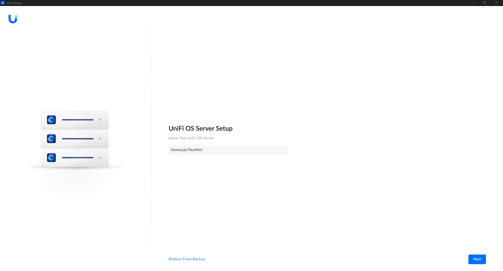
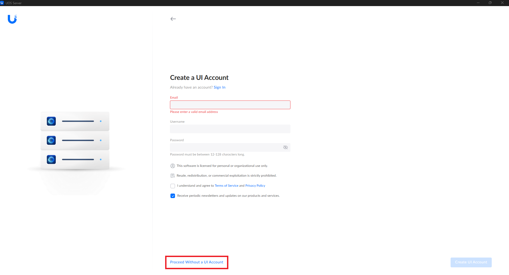
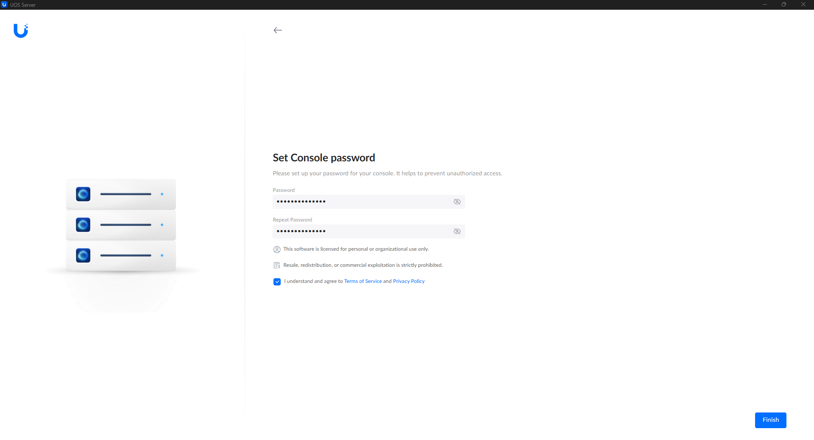
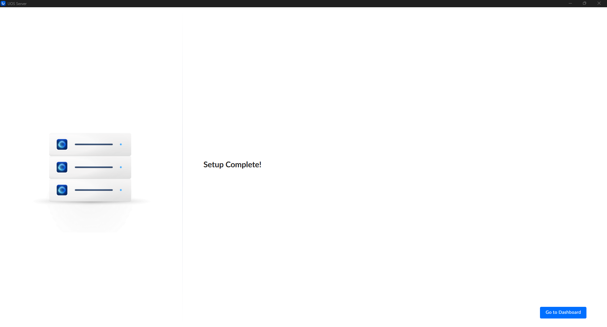
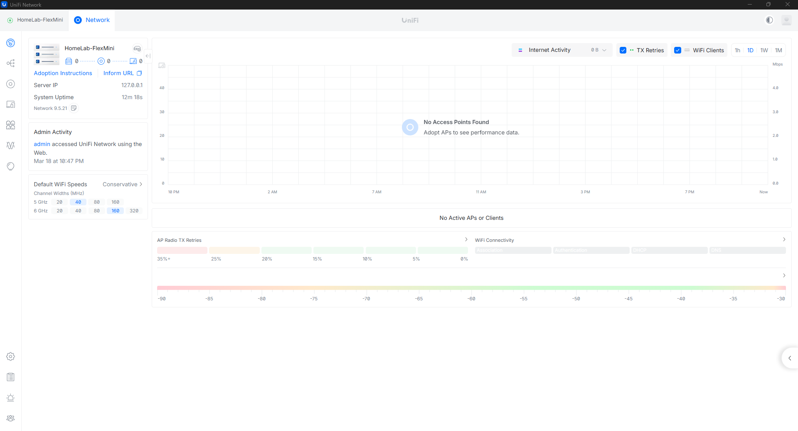
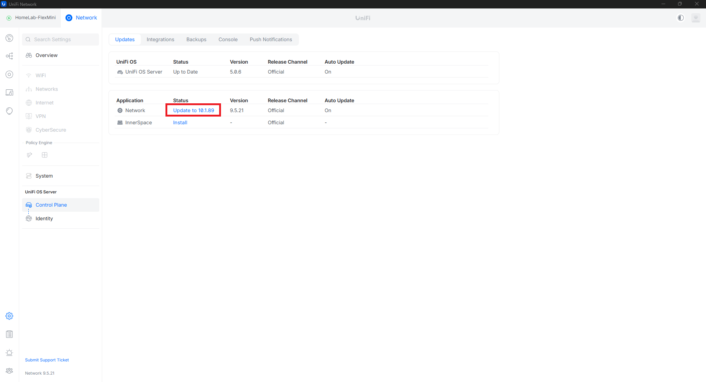
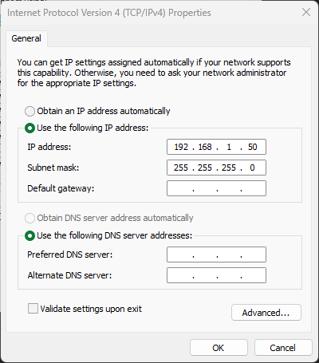
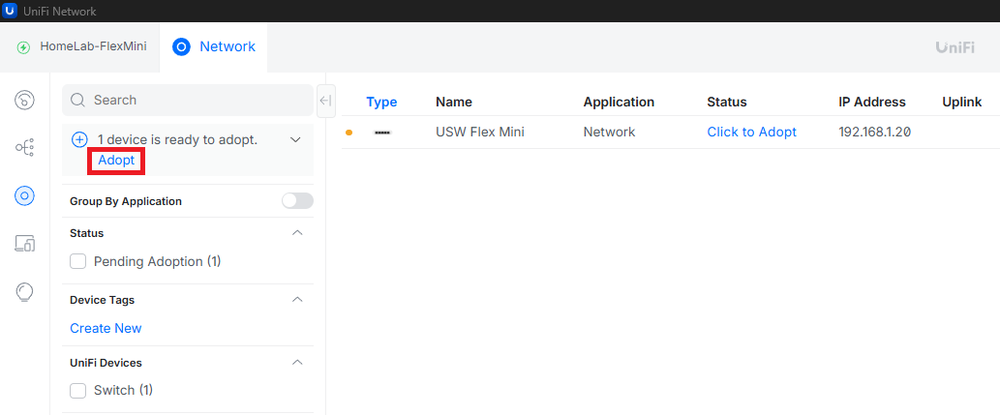
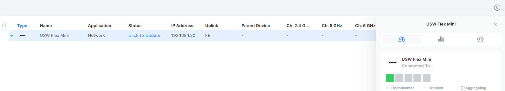

  
	

# UniFi OS Server – Post-Installation Configuration

A walkthrough of the initial UniFi OS setup after installation—covering dashboard configuration, account setup, and preparing your environment for device adoption.

---

## Initial Configuration

Once the interface loads, you’ll be prompted to name your network.

For this lab, I’ll be using: **HomeLab-FlexMini**.

Next, you’ll be asked to sign in or create an account. For this setup, I’ll **Proceed without a UI Account**.

---

### Set Console Credentials

Create a local console password for managing your UniFi OS instance:

---

### Setup Complete

Once everything is configured, you’ll see the completion screen:

From here, proceed to the main UniFi OS dashboard:

---

## Optional Step: Update Network Application

It’s a good idea to update the Network application right away, since the UniFi OS installer often includes an older version.

From the dashboard:

* Click **Network**, or navigate to **Settings → Control Plane**
* Click **Update** to install the latest version
* Wait approximately 2–3 minutes for the update to complete

---

## 🔌 Adopting Your USW-Flex-Mini

### Physical Setup Check

Before adoption, make sure your hardware is set up correctly:

* The Flex Mini is powered via USB (**required**)
* Ethernet cable connects the switch to your laptop
* Your laptop is connected to Wi-Fi for internet access
* The switch LED is **steady white** (ready for adoption)

---

### Static IP Configuration (Critical Step)

> This configuration applies specifically when connecting the Flex Mini directly to a Windows laptop.

> This step is critical because the switch and controller need to be on the same network to “see” each other—without it, the device often won’t show up for adoption.

To allow the controller to discover the switch, assign a static IP to your Ethernet adapter:

1. Go to:
   **Settings → Network & Internet → Advanced network settings → More network adapter options**
2. Right-click **Ethernet** → **Properties**
3. Select **Internet Protocol Version 4 (TCP/IPv4)** → **Properties**
4. Configure the following:

* IP Address: `192.168.1.50`
* Subnet Mask: `255.255.255.0`
* Default Gateway: *(leave blank)*
* DNS: *(leave blank)*

---

## Adoption

* Navigate to the **Devices** tab
* You should see the **USW-Flex-Mini** listed with a *Pending Adoption* status
* Click **Adopt**

> Initially, I wasn’t able to adopt the device directly through UniFi OS Server, but it worked through the Network application instead. I’ll cover this in more detail in the *Case Study* section.

---

## Success 🎉

Once adoption is complete:

* The device status will show as **Connected** with an assigned IP address
* The switch LED will change to **steady blue**
* The device is now fully operational

---

At this point, the switch is ready to use.

In the next step, I’ll be diving into **VLAN configuration** to segment and structure the network—where things start to get a lot more interesting.

